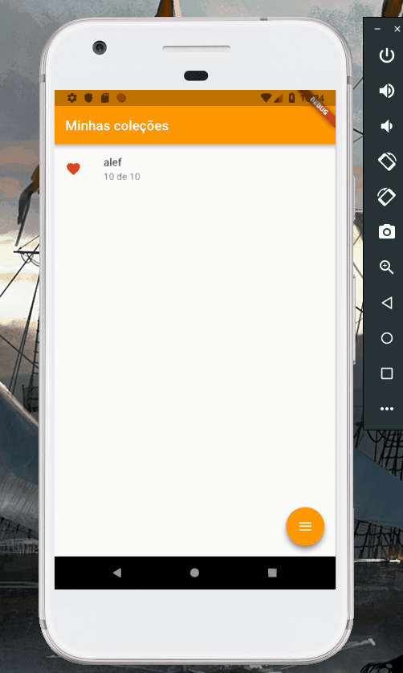

# Coleção de bolso

Esse é o repositório do aplicativo Coleção de Bolso disponível para Android.
A primeira versão foi construída nativamente com Android Studio + Java, agora o desafio é reescrevê-lo utilizando o Flutter, que é desenvolvido pela Google.

# Demonstração

<!--  -->
